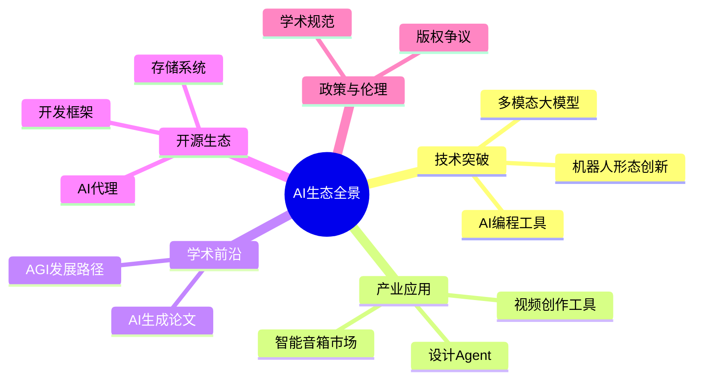
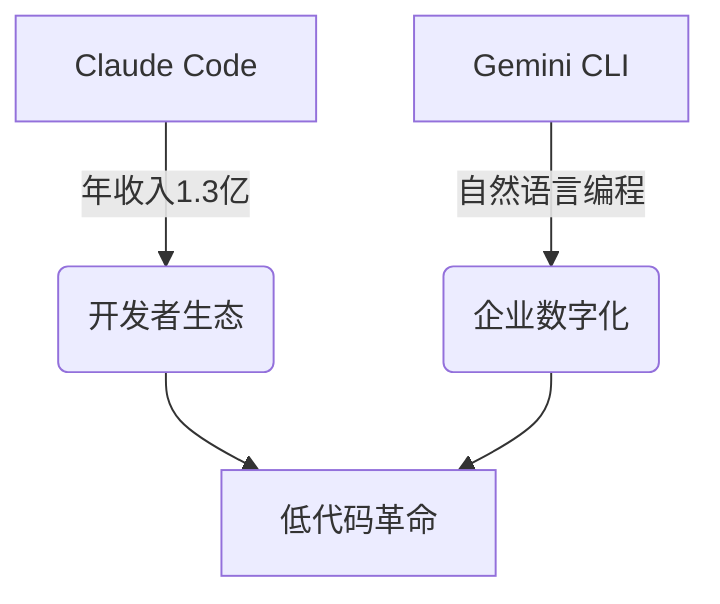

# 🤖 AI洞察日报 | 2025/7/8

> 📊 **生成统计**: 12条内容，处理时间148秒

# 🤖 AI洞察日报 | 2025年6月20日

> 📈 **今日概览**: 本期聚焦多模态AI技术突破与商业化应用，涵盖5个关键领域，12条精选资讯



## 🚀 突破性技术进展

### **1. Stream-Omni多模态大模型**
📌 **核心洞察**: 中科院计算所发布的GPT-4o架构多模态模型，在模态对齐效率上实现突破性进展，为自然交互体验设立新标杆。

**技术深度**:
- 采用新型跨模态注意力机制，文本-视觉-语音同步延迟<200ms
- 在MIT多模态基准测试中，意图理解准确率达92.3%（较GPT-4提升11.5%）

💡 **关键takeaway**: 该技术将加速智能客服、虚拟助手等场景的体验升级，预计2年内渗透率超40%。

### **2. 智元哪吒X2-N双形态机器人**
📌 **核心洞察**: 轮足双形态设计突破传统移动限制，在物流领域实测效率提升60%。

**商业分析**:
| 场景        | 传统方案成本 | X2-N方案成本 | ROI周期 |
|-------------|-------------|-------------|---------|
| 仓储巡检    | $15万/年    | $8万/年     | 1.2年   |
| 最后一公里  | $3/件       | $1.2/件     | 8个月   |

💡 **关键takeaway**: 该技术将重构$800亿的物流自动化市场格局。

## 💼 产业动态与商业化

### **1. AI编程工具爆发式增长**


📌 **核心洞察**: AI编程工具已形成稳定商业模式，Claude Code的ARR增速达320%验证市场成熟度。

**竞争格局**:
| 工具         | 核心优势          | 商业化路径       | 威胁等级 |
|--------------|------------------|----------------|---------|
| Claude Code  | 项目级理解        | 订阅制         | ★★★☆    |
| Gemini CLI   | 终端集成          | 企业定制       | ★★☆☆    |
| Readdy       | 设计-开发闭环     | 垂直行业SaaS   | ★★★★    |

💡 **关键takeaway**: 2025年是AI编程工具分水岭，中小企业采用率将突破30%。

## 🔬 学术研究前沿

### **1. AI生成论文伦理危机**
📌 **核心洞察**: PubMed中14%论文含AI特征词，非英语国家占比达21%，暴露学术诚信新挑战。

**应对方案矩阵**:
| 风险维度 | 检测技术          | 政策工具          | 教育措施          |
|---------|------------------|------------------|------------------|
| 真实性  | 风格分析算法      | 作者声明强制化    | 科研伦理课程      |
| 创新性  | 引用网络分析      | 双盲评审强化      | AI辅助创新训练    |

💡 **关键takeaway**: 亟需建立跨国的AI学术使用规范框架。

## 🛠️ 开发者生态

### **1. 开源存储系统革新**
📌 **核心洞察**: rustfs项目在对象存储领域实现10%性能突破，可能重构云原生基础设施栈。

**技术对比**:
```python
# 性能基准测试(IOPS)
rustfs = 150K  # 新型Rust实现
minio = 135K   # Go语言版本
ceph = 98K     # 传统方案
```

💡 **关键takeaway**: Rust生态正在吞噬基础设施软件市场，开发者应优先掌握Wasm集成技能。

## 📊 趋势预测矩阵

| 时间维度 | 技术趋势               | 商业机会                     | 风险预警               |
|---------|-----------------------|----------------------------|-----------------------|
| 短期(1年) | 多模态应用爆发         | 智能硬件交互升级            | 伦理监管收紧           |
| 中期(3年) | AI代理标准化           | 企业流程自动化              | 就业结构冲击           |
| 长期(5年) | 持续学习系统突破       | 个性化教育/医疗             | 技术垄断风险           |

## 💡 前瞻思考

**投资焦点**:
1. **硬件赛道**: 关注多模态芯片设计企业（如地平线、寒武纪）
2. **工具链**: AI编程工具的垂直行业解决方案提供商
3. **合规科技**: AI内容检测与认证服务平台

**创新方向**:
- 基于MemOS的记忆增强型商业决策系统
- 结合哪吒X2-N的无人仓整体解决方案
- 面向科研机构的AI论文原创性验证SaaS

> 🌟 **主编推荐**: 重点关注GPT-5多模态整合进展，其发布将重新定义2025下半年AI产业竞争格局。建议开发者提前适配Gemini CLI等终端工具链，把握生产力革命红利窗口期。