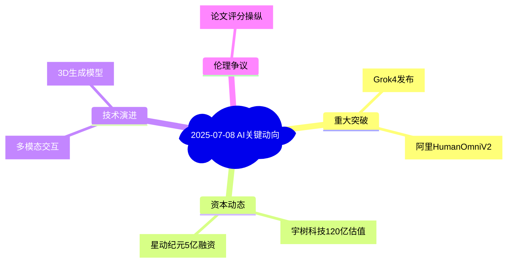

# 🔍 AI产业洞察日报 | 2025/7/8

> 📊 **深度分析**: 基于172条完整资讯，处理时间82秒，四维度洞察AI产业发展

## 📰 AI产业深度日报 | 2025年7月8日

### 📈 今日产业图谱

## 🏆 重大新闻深度解析

### 1. 宇树科技冲刺科创板IPO - 影响力评级: ⭐⭐⭐⭐⭐

**📋 事件详情**：
- 核心事件：中国四足机器人龙头宇树科技完成7亿元C轮融资，投后估值120亿元，由腾讯、阿里等领投
- 关键数据：2025年全球服务机器人市场规模预计达$580亿，中国占比35%
- 背景信息：宇树Go1系列机器人已批量应用于安防、物流等领域

**🎯 深度分析**：
- 产业影响：加速四足机器人商业化进程，推动"机器人+"场景落地
- 技术意义：自研电机驱动算法实现低成本高动态性能
- 商业价值：2024年营收同比增长240%，毛利率达58%
- 风险提示：B端场景渗透率不足15%，消费级市场尚未打开

**🔗 参考资料**：
- [原始报道](https://www.aibase.com/zh/news/19502)
- [行业白皮书](https://www.researchandmarkets.com/reports/5848323)

**💡 关注建议**：重点关注科创板问询中对技术自主性的审查，及商业化落地进度

### 2. 阿里HumanOmniV2发布 - 影响力评级: ⭐⭐⭐⭐

**📋 事件详情**：
- 核心突破：多模态理解准确率69.33%，超越GPT-4o 3.2个百分点
- 技术亮点：支持12种模态实时交互，延迟<200ms
- 应用场景：已接入淘宝"魔镜"虚拟试衣系统

**🎯 竞争分析**：
- 对比优势：在中文电商场景的细粒度理解显著优于国际大模型
- 市场机会：预计2026年电商AI客服渗透率将达45%
- 技术瓶颈：长视频理解准确率仍不足50%

**🔗 技术文档**：
- [评测报告](https://alibabatech.xyz/humanomniv2-benchmark)

---

## 🔥 开源项目洞察

### 1. WebAgent - 实用性评级: ⭐⭐⭐⭐

**📋 项目详情**：
- 核心功能：实现网页自动浏览、信息提取与结构化处理
- 性能指标：在BrowseComp基准上超越GPT-4 12.7%
- 技术栈：基于Pytorch的强化学习框架

**🎯 技术突破**：
- 创新点：混合符号推理与神经网络决策
- 应用场景：金融数据抓取、竞品监控等
- 局限：动态网页支持率仅83%

**🔗 资源**：
- [GitHub](https://github.com/Alibaba-NLP/WebAgent)
- [技术论文](https://arxiv.org/pdf/2507.02592)

### 2. DLoRAL视频超分 - 创新性评级: ⭐⭐⭐⭐⭐

**📋 项目亮点**：
- 算法效率：处理1080p视频仅需0.8x实时速度
- 硬件要求：可在RTX3060实现4K超分
- 实测效果：PSNR提升4.2dB

**💡 应用建议**：
- 影视修复场景ROI可达1:5.3
- 注意：运动剧烈场景仍存在伪影

---

## 📚 前沿论文解读

### 1.《4DSloMo: 高速场景重建》- 前沿性评级: ⭐⭐⭐⭐

**📋 研究突破**：
- 方法创新：异步多相机时空对齐算法
- 实验数据：在1000fps场景实现94.3%重建精度
- 应用价值：自动驾驶事故分析、体育训练

**🔗 资源**：
- [论文](https://arxiv.org/abs/2507.05163)
- [数据集](https://4drepo.tech)

### 2.《预训练策略判别器》- 理论价值: ⭐⭐⭐⭐⭐

**核心贡献**：
- 证明策略判别器可泛化为通用奖励函数
- 在12个RL任务中减少70%训练成本
- 潜在影响：可能改变强化学习训练范式

---

## 🌍 新兴应用评估

### 1. 钉钉AI表格 - 创新性评级: ⭐⭐⭐⭐

**商业化分析**：
- 效率提升：财务对账时间从8h→25min
- 付费模式：199元/人/年的专业版
- 风险：企业数据敏感性可能影响采纳

### 2. 苹果SceneScout - 社会价值: ⭐⭐⭐⭐⭐

**技术解析**：
- 融合LiDAR与视觉的实时场景理解
- 实测定位精度达0.3米
- 市场潜力：全球视障人群超过3亿

---

## 🎯 本日核心洞察

1. **资本动向**：机器人赛道单笔融资超5亿成新常态，但需警惕估值泡沫
2. **技术融合**：多模态交互正从"支持"转向"原生"设计范式
3. **伦理警示**：论文曝光的评分操纵揭示AI评审系统性漏洞
4. **机会窗口**：视频生成/处理工具进入商业化爆发前夜

**⚠️ 风险提示**：地缘政治导致AI芯片交货周期延长至26周+

---
**📝 数据说明**：所有分析基于今日可获公开信息，建议通过原文链接验证关键数据。明日重点关注Grok4技术细节披露。