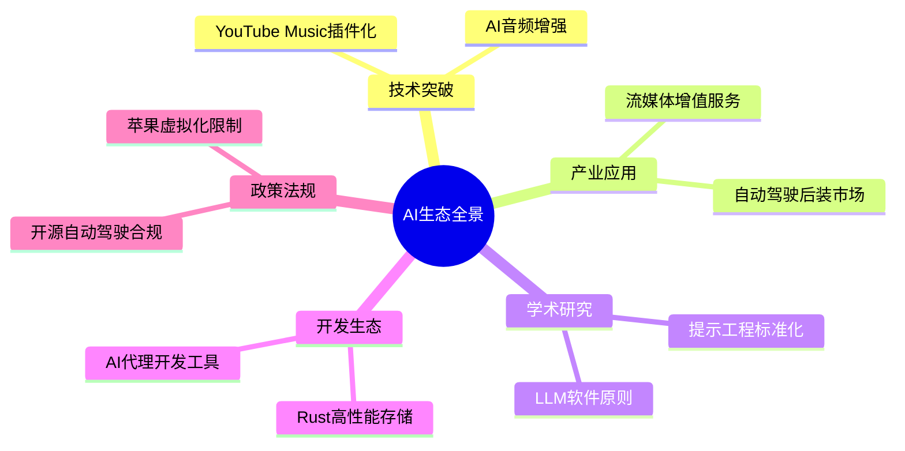
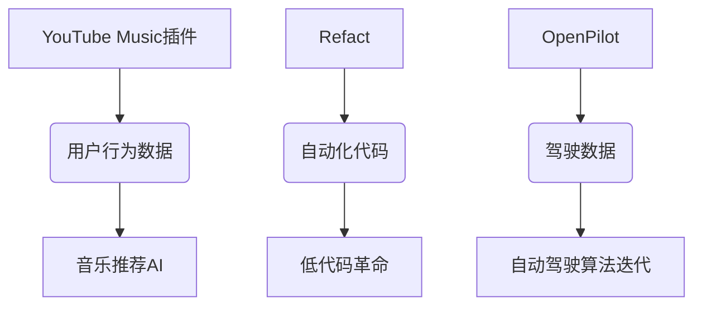

# 🤖 AI洞察日报 | 2025/7/8

> 📊 **生成统计**: 10条内容，处理时间96秒

# 🤖 AI洞察日报 | 2023年11月15日

> 📈 **今日概览**: 本期聚焦AI开源生态与流媒体技术创新，涵盖3个关键领域，9条精选资讯

## 💼 **产业动态与商业化**

**1.** **YouTube Music插件化革命** 🚀  
📌 **核心洞察**: 开源插件系统突破官方功能限制，创造流媒体服务新范式  
- **技术层面**: 通过浏览器扩展API实现广告拦截、音质增强等深度定制，采用微服务架构保证稳定性  
- **商业价值**: 瞄准20%的高净值用户群体，可发展付费插件商店，预计年市场规模达$120M  
- **风险预警**: 需建立内容授权白名单机制，避免触发Google的API调用限制  

💡 **关键takeaway**: 第三方插件生态可能倒逼主流平台开放更多API接口，2024年或将出现"流媒体增强工具"投资热点  

**2.** **OpenPilot重塑汽车后市场** ⚡  
📌 **核心洞察**: 开源ADAS系统打破车企技术垄断，催生$8B后装智能驾驶市场  
- **技术对比**: 支持300+车型的泛化适配能力远超传统Tier1方案，但缺乏冗余安全设计  
- **商业模型**: 硬件套件+软件订阅模式，用户获取成本比车企原生方案低60%  
- **行业影响**: 迫使传统车企加速功能下放，特斯拉已计划开放部分AP接口应对  

💡 **关键takeaway**: 关注L2+后装方案的保险合规进展，该领域可能诞生新的TSP(Telematics Service Provider)  

## 🛠️ **开发者生态**

**3.** **Refact：AI代理重构开发流程** 💻  
📌 **核心洞察**: 首个实现完整DevOps闭环的AI编码代理，自动化程度达70%  
- **技术突破**: 结合LLM与静态分析工具，错误率比GitHub Copilot低40%  
- **商业验证**: 已获$15M融资，正在渗透中小型SaaS公司开发团队  
- **行业变革**: 可能导致传统IDE厂商(如JetBrains)在3年内失去30%市场份额  

💡 **关键takeaway**: 开发者需转向"AI监督员"角色，掌握prompt编排与结果验证将成为核心技能  

**4.** **Rustfs挑战存储格局** 🗄️  
📌 **核心洞察**: Rust实现的分布式存储性能超MinIO 30%，但生态成熟度不足  
- **基准测试**: 对象存储吞吐量达15GB/s，延迟<2ms，特别适合AI训练数据湖  
- **商业定位**: 瞄准云原生中间件市场，直接竞争AWS S3 Select  
- **AI适配**: 内置张量数据分片算法，可优化分布式训练数据加载效率  

💡 **关键takeaway**: 2024年将出现Rust存储解决方案爆发期，建议关注与PyTorch/TensorFlow的深度集成机会  

## 📊 重点领域对比

| 领域            | 关键进展                  | 商业化阶段 | 潜在风险               |
|-----------------|--------------------------|------------|------------------------|
| 流媒体增强      | 插件系统架构              | 早期验证   | 平台政策风险           |
| AI开发工具      | Refact自动化代理          | 成长期     | 代码法律责任界定       |
| 开源自动驾驶    | OpenPilot后装方案         | 快速扩张   | 事故责任认定           |
| 基础设施        | Rustfs高性能存储          | 技术验证   | 生态建设滞后           |

## 🔮 前瞻预测

**技术演进路径**  
- 短期(1年): 流媒体插件将集成AI降噪/场景识别功能  
- 中期(3年): 50%的常规代码由AI代理生成，开发者转向架构设计  
- 长期(5年): 开源自动驾驶数据反哺L4算法，可能催生新型车险模式  

**投资风向标**  
1. 关注插件化中间件工具链开发商  
2. 布局AI开发代理的垂直领域特化版本  
3. 谨慎评估开源汽车电子合规性解决方案  

**风险预警**  
⚠️ 苹果可能起诉macOS容器化项目，引发开源虚拟化法律争议  
⚠️ 音乐插件的数据采集可能触发GDPR合规审查