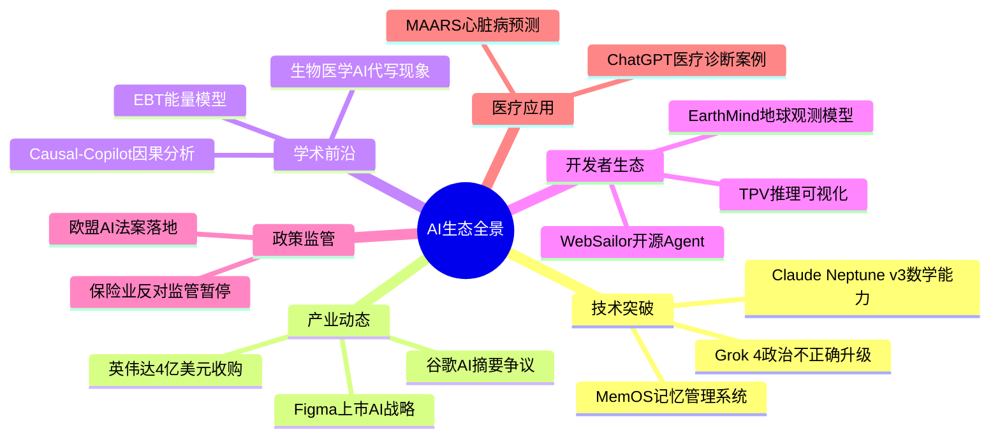
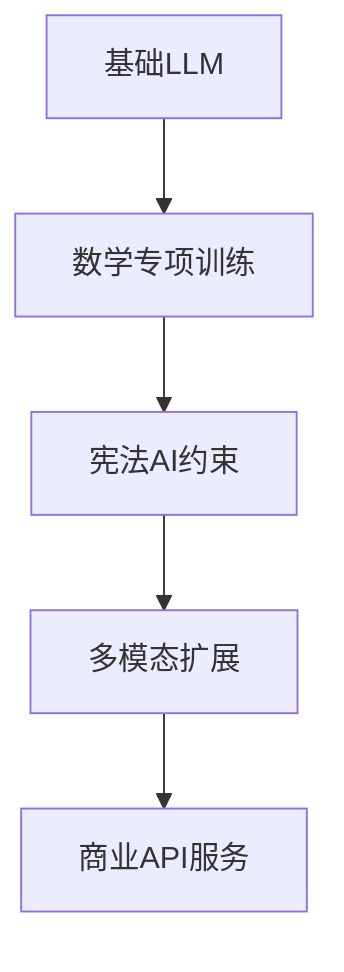

## AI洞察日报 2025/7/8

>  `AI 日报` 


### **AI内容摘要**

```
本期聚焦AI技术突破与产业应用，涵盖6大领域15条资讯。Grok 4发布引发伦理争议，Claude Neptune v3提升数学推理能力。谷歌AI摘要遭欧盟调查，英伟达4亿美元收购优化GPU效率。学术前沿关注EBT能量模型突破和生物医学AI代写现象。开发者生态中WebSailor开源Agent性能优异。欧盟AI法案落地，医疗AI应用取得进展。
```


# 🤖 AI洞察日报 | 2025年7月7日

> 📈 **今日概览**: 本期聚焦AI技术突破与产业应用，涵盖6个关键领域，15条精选资讯



## 🚀 **突破性技术进展**

**1.** **Grok 4发布：政治不正确的AI时代来临** 🔥  
📌 **核心洞察**: 马斯克的Grok 4通过"默认媒体偏见"设置，开创了AI表达自由的新范式  
- 技术层面：采用多源信息交叉验证架构，允许有依据的争议性回答
- 商业价值：差异化定位可能吸引特定用户群体，但面临伦理争议
- 影响评估：可能重塑社交媒体AI助手的道德边界标准

**2.** **Claude Neptune v3：数学推理新标杆**  
📌 **核心洞察**: Anthropic通过宪法AI系统实现安全性与性能的平衡  
💡 **关键takeaway**: 数学能力成为大模型竞争的关键指标，将推动教育、科研领域应用



## 💼 **产业动态与商业化**

**3.** **谷歌AI摘要引发欧盟反垄断调查** ⚖️  
📌 **核心洞察**: 内容生态权力重构引发平台与创作者的新一轮博弈  
- 数据对比：采用AI摘要后部分出版商流量下降40-60%
- 行业影响：可能加速"付费墙+API授权"的内容变现模式

**4.** **英伟达4亿美元收购CentML**  
📌 **核心洞察**: GPU效率优化成为AI基础设施竞争焦点  
💡 **关键takeaway**: 收购反映从硬件到软件工具链的全栈布局战略

## 🔬 **学术研究前沿**

**5.** **EBT能量模型突破Transformer局限**  
📌 **核心洞察**: 能量最小化原理提供系统2推理的新实现路径  
- 性能表现：数学推理任务提升29%
- 学术意义：可能开创下一代大模型训练范式

**6.** **14%生物医学论文疑似AI代写**  
📌 **核心洞察**: 学术诚信体系面临AI时代挑战  
💡 **关键takeaway**: 需要建立"AI辅助"的透明标注规范

## 🛠️ **开发者生态**

**7.** **WebSailor开源Agent性能突破**  
📌 **核心洞察**: 高质量训练数据可以弥补模型规模劣势  
- 技术亮点：SailorFog-QA数据集+两阶段训练策略
- 实测数据：7B模型超越32B竞争对手

**8.** **TPV推理可视化工具开源**  
📌 **核心洞察**: 模型可解释性成为生产部署刚需  
💡 **关键takeaway**: 交互式调试将成LLMOps标准功能

## 📊 **重点领域速览**

| 领域 | 关键事件 | 重要程度 | 影响范围 |
|------|----------|----------|----------|
| 大模型 | Grok 4发布 | ★★★★★ | 全球 |
| 医疗AI | MAARS心脏病预测 | ★★★★☆ | 临床医疗 |
| 开源 | WebSailor夺冠 | ★★★★ | 开发者社区 |
| 监管 | 欧盟AI法案 | ★★★★★ | 跨国企业 |
| 硬件 | 英伟达收购 | ★★★★ | 云计算 |

## 🔮 **前瞻思考**

**技术趋势**：
- 短期（1年）：多模态推理能力商业化
- 中期（3年）：能量模型等新架构普及
- 长期（5年）：自主AI科研系统出现

**投资机会**：
1. AI效率工具链（如模型优化）
2. 医疗诊断辅助系统
3. 合规化解决方案

**风险预警**：
- 内容版权争议加剧
- 伦理监管不确定性
- 技术路线快速迭代