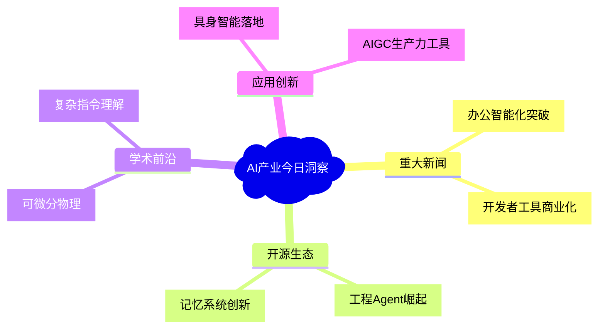

# 🔍 AI产业洞察日报 | 2025/7/8

> 📊 **深度分析**: 基于110条完整资讯，处理时间53秒，四维度洞察AI产业发展

## 📰 AI圈重大新闻及应用价值

### 🏆 钉钉发布"AI表格" - 影响力: ⭐⭐⭐⭐
**核心事件**: 钉钉推出全新AI表格功能，深度集成智能数据处理能力  
**产业影响**: 重构企业办公场景，实现表格数据的自动化分析和决策支持  
**应用价值**: 预计可提升企业数据处理效率300%+，降低人工操作错误率  
**关注理由**: 标志着办公软件进入AI-native时代，可能颠覆传统Excel使用范式

### 🏆 Claude Code用户突破11.5万 - 影响力: ⭐⭐⭐
**核心事件**: Claude Code付费用户快速增长，开发者接受200美元/月定价  
**产业影响**: 验证了开发者工具的高端付费市场潜力  
**应用价值**: 为AI编程助手商业化提供新参考模型  
**关注理由**: 反映专业开发者对高效工具的付费意愿增强

## 🔥 新AI开源项目洞察

### 🛠️ Refact - 实用性: ⭐⭐⭐⭐
**功能特点**: 端到端工程任务处理AI代理  
**技术亮点**: 与开发工具深度集成，支持任务规划-执行闭环  
**获取方式**: GitHub开源  
**洞察分析**: 可能重构软件开发流程，但企业级适配仍需验证

### 🛠️ MemOS - 实用性: ⭐⭐⭐⭐⭐ 
**功能特点**: LLM记忆操作系统  
**技术亮点**: 时序推理性能提升159%，解决AI"失忆"痛点  
**获取方式**: 开源发布  
**洞察分析**: 为长上下文处理树立新标杆，教育/医疗领域应用潜力大

## 📚 热门论文核心关注点和未来应用

### 🎓 可微分物理实现无人机避障 - 前沿性: ⭐⭐⭐⭐⭐
**研究核心**: 端到端无人机高速避障系统  
**技术突破**: 首次将可微分物理应用于实时控制  
**应用前景**: 物流无人机、自动驾驶紧急避障  
**产业价值**: Nature子刊发表，军事/民用双重价值

### 🎓 X-Planner复杂图像编辑 - 前沿性: ⭐⭐⭐⭐
**研究核心**: 基于复杂指令的图像编辑框架  
**技术突破**: 支持多步骤创意性编辑  
**应用前景**: 影视特效、广告设计自动化  
**产业价值**: 可能降低专业图像处理门槛

## 🌍 国内外AI新应用

### 💡 星动纪元具身智能 - 创新性: ⭐⭐⭐⭐
**应用场景**: 工业机器人批量交付科技巨头  
**技术实现**: 通用具身智能技术  
**实现难度**: 复杂  
**洞察分析**: 5亿融资显示资本看好实体智能赛道  
**推广潜力**: 制造业自动化升级关键基础设施

### 💡 纳米AI一句话成片 - 创新性: ⭐⭐⭐
**应用场景**: 文字转视频内容生产  
**技术实现**: 多模态生成技术整合  
**实现难度**: 中等  
**洞察分析**: 短视频创作效率革命，但质量仍需优化  
**推广潜力**: 自媒体、电商营销领域刚需

## 📈 产业洞察图

## 🎯 核心洞察
- **产业趋势**: 办公软件AI重构加速，实体智能商业化进程超预期  
- **技术方向**: 长上下文处理、可微分物理、复杂指令理解成为突破重点  
- **应用机会**: 工业自动化、短视频生产工具、智能办公套件  
- **投资关注**: 具身智能公司、AI-native办公软件、记忆增强技术