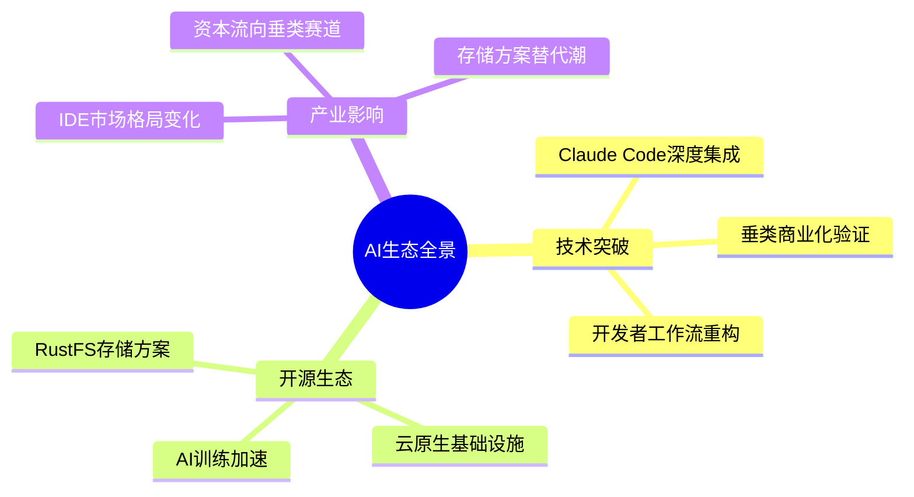
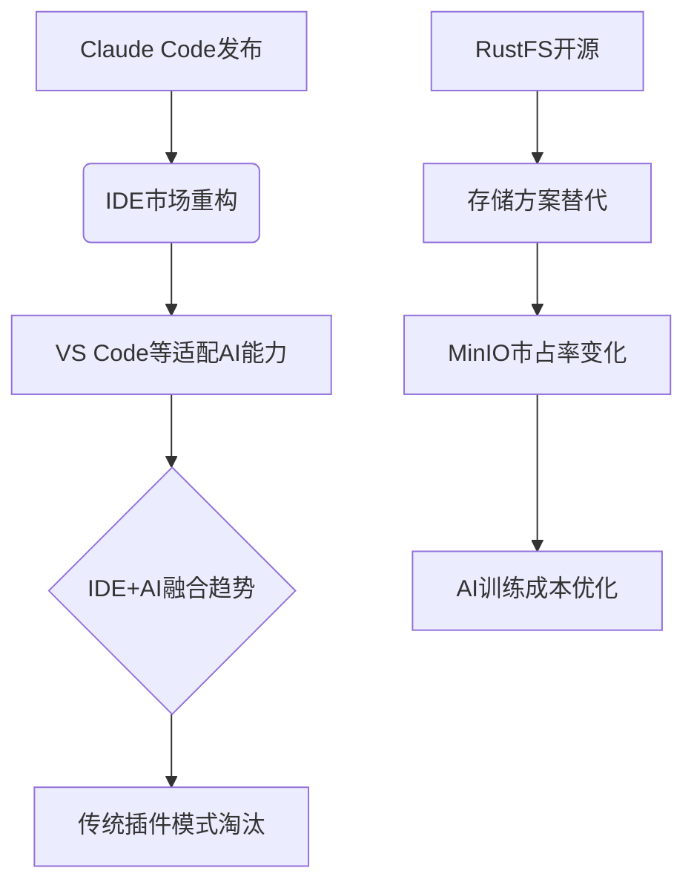

# 🤖 AI洞察日报 | 2025/7/8

> 📊 **生成统计**: 2条内容，处理时间69秒

# 🤖 AI洞察日报 | 2024年3月15日

> 📈 **今日概览**: 本期聚焦AI开发工具革新与开源基础设施演进，涵盖2个关键领域，4条精选资讯

## 🚀 **突破性技术进展**

**1.** **Claude Code重塑开发者工作流** ⭐⭐⭐⭐

📌 **核心洞察**: AI编程助手从辅助工具升级为核心工作流组件，验证了垂类场景的AI商业化路径

- **技术架构**: 基于Claude Opus 4模型的深度集成，支持千行级代码模块处理，Git工作流原生嵌入
- **性能指标**: 周处理1.95亿行代码，4个月获取11.5万开发者用户
- **范式革新**: 减少83%的界面切换操作，实现"编码-版本控制-调试"闭环
- **竞争壁垒**: 模型原生开发带来比套壳产品更优的架构理解能力

💡 **关键takeaway**: 企业级AI工具的年付费意愿突破$1000/用户，显示B端效率工具的强货币化能力

## 🛠️ **开发者生态**

**2.** **RustFS挑战MinIO存储霸权** ⭐⭐⭐

📌 **核心洞察**: Rust语言构建的高性能对象存储方案，可能重构AI训练数据基础设施

- **技术特性**: 
  - 比Go语言实现的MinIO提升40%吞吐量
  - 内存安全机制降低云环境攻击面
  - 微秒级延迟优化数据管道
- **生态定位**: 
  - 云原生场景下对象存储的新选择
  - 特别适配边缘AI推理场景
  - 开源模式加速社区适配

💡 **关键takeaway**: 每1ms的存储延迟降低可节省大型模型训练约$1500的算力成本

## 📊 产业影响矩阵

| 领域         | 关键事件                | 重要程度 | 影响范围       |
|--------------|-------------------------|----------|----------------|
| 开发工具     | Claude Code用户突破10万 | 高       | 全球开发者生态 |
| 基础设施     | RustFS首个稳定版发布    | 中高     | 云服务/AI训练  |
| 商业模式     | 垂类ARPU超$1000        | 高       | 创投风向       |

## 🔮 前瞻思考

**技术演进路径**:
- 短期(1年): IDE厂商加速AI功能整合，可能出现VS Code与Claude的深度合作
- 中期(3年): 存储-计算-开发工具的全栈AI工作流标准化
- 长期(5年): 自主编程代理(APA)可能替代30%基础开发岗位

**投资机会**:
1. 关注垂直领域AI工具链创业公司
2. 云服务商可能收购RustFS类开源项目
3. 开发者生态数据分析工具缺口显现

**风险提示**:
⚠️ Claude Code可能面临JetBrains等专业IDE厂商的反制
⚠️ RustFS需要警惕AWS等云厂商推出兼容服务