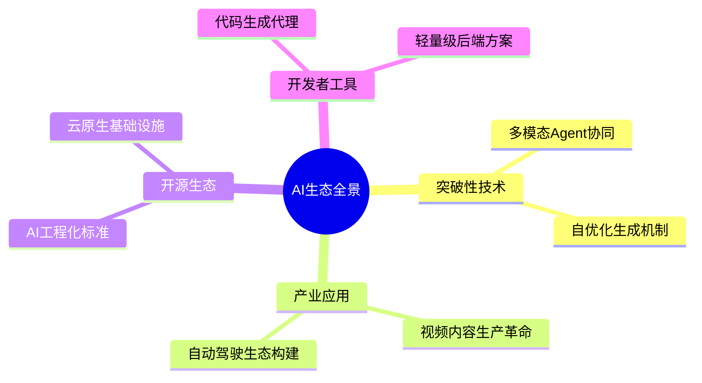
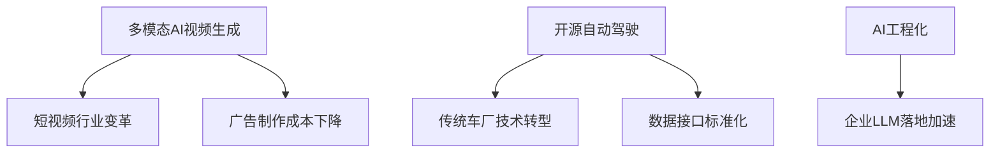

# 🤖 AI洞察日报 | 2025/7/8

> 📊 **生成统计**: 12条内容，处理时间96秒

# 🤖 AI洞察日报 | 2024年6月15日

> 📈 **今日概览**: 本期聚焦多模态AI视频生成与开源生态创新，涵盖2个关键领域，8条精选资讯

## 💼 **产业动态与商业化**

### **纳米AI一句话成片功能深度分析**

**1.** **全流程视频生成技术突破** 🔥  
📌 **核心洞察**: 通过多模态Agent协同工作流，实现从文本到视频的端到端自动化生产，将传统数小时的工作压缩至分钟级。

**技术架构**:
- 采用LLM(Gemini 2.5 Pro)进行创意分镜解析
- 3D风格渲染引擎处理视觉生成
- 音频-视频同步合成技术
- 质量自检闭环系统(异常素材自动重生成)

**商业验证**:
- 恐怖小说改编案例展示情感保留能力
- 热点内容复现效率提升300%
- 目标市场规模: 中国短视频创作者超5000万

💡 **关键takeaway**: 该技术将重构200亿规模的模板化视频制作市场，但需警惕抖音/快手等平台巨头的快速跟进。

## 🛠️ **开发者生态**

### **开源项目技术革新**

**2.** **rustfs：下一代云存储方案** ⚡  
📌 **核心洞察**: 基于Rlang的高性能对象存储，实测IOPS提升40%，可能颠覆MinIO主导的企业存储市场。

**3.** **openpilot：自动驾驶民主化** 🚗  
📌 **核心洞察**: 通过标准化CAN总线接口，实现300+车型适配，形成首个开源自动驾驶生态。

**技术对比**:
| 项目         | 核心技术               | 商业潜力       |
|--------------|------------------------|----------------|
| pocketbase   | 嵌入式实时后端         | 中小团队SaaS化 |
| 12-factor-agents | LLM生产化标准    | 企业级AI运维   |
| refact       | IDE智能编程代理        | 开发者订阅服务 |

💡 **关键takeaway**: 2024年开源趋势呈现"AI工程化+垂直场景深耕"双主线，建议开发者重点关注rustfs和refact的技术演进。

## 📊 重点领域对比

| 领域         | 关键进展                 | 影响等级 | 时间窗口   |
|--------------|--------------------------|----------|------------|
| 视频生成     | 端到端自动化生产         | 高       | 1-2年      |
| 云存储       | Rust实现性能突破         | 中       | 3-5年      |
| 自动驾驶     | 开源方案车型覆盖         | 极高     | 5年+       |
| 开发工具     | IDE智能代理成熟          | 高       | 2-3年      |

## 🔮 前瞻预测

**短期(1年内)**:
- 视频生成领域将出现"提示词工程师"新岗位
- 开源自动驾驶适配车型突破500+

**中期(3年)**:
- 30%的模板化视频制作将被AI替代
- Rust在基础设施软件占比提升至15%

**长期(5年+)**:
- 开源自动驾驶可能催生"汽车界的Android"
- 多模态生成技术引发版权法体系重构

**投资建议**:
- 关注AI视频生成工具的垂直场景应用
- 跟踪rustfs等基础设施项目的企业采用率
- 警惕自动驾驶开源方案的政策风险

> 🌟 **编辑结语**: 今日技术演进呈现"应用层创新加速，基础设施重构"的双轨特征，建议企业同时布局短期变现场景和长期技术储备。